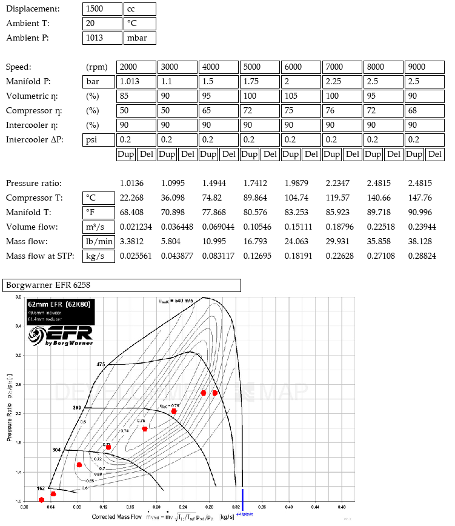

# Volute

Volute is a graphical turbocharger selection program inspired by [BorgWarner MatchBot](https://www.borgwarner.com/matchbot/).
Given a set of engine parameters, it plots flow rate vs. pressure ratio on a compressor map.

Volute can plot up to 16 points on the compressor map.
Points can be inserted and deleted dynamically.

Volute supports both metric and imperial units.
The unit for each parameter can be changed on the fly.

Unlike MatchBot, which includes only BorgWarner turbos, Volute can be used to compare turbos from different brands.
You can even add your own.

The compressor is only one side of the story.
A turbine that is well-matched to the engine is just as important.
Unfortunately, turbine data are not as readily available as compressor maps are.
As a result, Volute neglects the turbine side and focuses only on the compressor.
If you plan to use a BorgWarner turbo, then MatchBot is your best bet because it includes a turbine sizing selector to help you choose the right turbine and housing.

## Compiling on Linux/BSD/MacOS

### Requirements
- A C compiler (gcc)
- make
- SDL2

### Instructions
1. Clone the repository: `git clone https://github.com/sam-rba/volute.git`.
2. Move to the directory: `cd volute`.
3. Compile Volute: `make` or `make -j$(nproc)`.
4. Run Volute: `./volute`.

## Compiling on Windows

Work in progress.
Only Unix-like operatings systems are supported for now.

## Usage

Some knowledge of combustion engines and turbocharger compressor maps is required to use Volute effectively.
There are lots of good books about turbos, and there's lots of good (and bad) information online as well.

- _Turbochargers_, Hugh MacInnes, 1976.
- _Maximum Boost_, Corky Bell, 1997.
- [Garrett Knowledge Center](https://www.garrettmotion.com/knowledge-center-category/oem/expert/).
- [BorgWarner MatchBot Tutorial](https://youtu.be/qIGDnbaBcJI).
- Websites and forums.

Enter the characteristics of your engine and start plotting points in its operating area.
Insert or delete points by pressing the `Dup` (duplicate) and `Del` (delete) buttons.

Change the unit that a parameter is displayed in by clicking on the unit and selecting a different one from the dropdown list.

Select a compressor by pressing the compressor dropdown and selecting one from the list.
Type in the brand name, series, or model name of the compressor you're looking for and press `filter` to narrow down the list.

## Adding compressors

Compressor maps are kept in the [`compressor_maps/`](compressor_maps/) directory.
Each compressor has a JPEG image of the compressor map and a TOML file which describes it.

To add a compressor, find an image of its compressor map and convert it to JPEG format.
Then create a TOML file with the same base file name as the image and fill in the information about the compressor.
For example, `borgwarner_efr_8374.jpg` and `borgwarner_efr_8374.toml`.
Check out the existing ones to get an idea.

A compressor's TOML file includes the brand of the company that manufactured it, the series that the turbo is a part of, and the name of the specific model.
It also defines what type of units the compressor map uses for the flow rate on the x-axis.
Valid flow rate units are `kg/s`, `lb/min`, `m³/s`, and `CFM`.
The y-axis is always a (unitless) pressure ratio.

A compressor's TOML file also defines two points on the compressor map: the origin, and a reference point.
The origin should be the lowest (flow, PR) point on the chart, in the bottom-left corner.
The reference point should be as far away from the origin, in the top-right, as practical, to increase the resolution in between.

Each point has an x- and y-coordinate, measured in pixels from the top-left of the image.
Each point also has the flow rate and pressure ratio at that point on the compressor map.
Use an image editing program like MS Paint to find the pixel coordinates of each point, and record the corresponding flow rate and pressure ratio.
